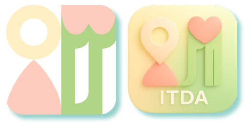

# ItDa
Places recommendation program for couple


## Project Overview

ItDa is a couple-oriented place recommendation application consisting of:
- **Flutter mobile app** (`itda_app/`) - Frontend mobile application
- **FastAPI backend** (`backend/`) - REST API server with OpenAI integration
- **Recommendation algorithm** (`algorithm.py`) - Cosine similarity-based place recommendation

## Setup
**Environment Setup**: Create `.env` file in `backend/` directory with required keys:
- `OPENAI_API_KEY` - OpenAI API access
- `GOOGLE_PLACES_API_KEY` - Google Places API
- `NAVER_CLIENT_ID` / `NAVER_CLIENT_SECRET` - Naver API credentials
- `GOOGLE_CLIENT_ID` - Google OAuth Web Client ID (for backend token verification)
- `JWT_SECRET_KEY` - JWT signing key (generate with `openssl rand -hex 32`)


```
backend/
├── app/
├── scripts/ 
├── .env    # You need to create .env file with api keys
└── main.py                  
```
And then,
```
cd backend
pip install -r requirements.txt
```
To run the backend server, 
```
uvicorn app.main:app
```
Finally, you can run flutter app
```
# 에뮬레이터 위치 설정 (센트럴파크)
adb emu geo fix 126.6435981392 37.3903993102


# 에뮬레이터 위치 설정 (연세대학교 국제캠퍼스 진리관C)
adb emu geo fix 126.671083 37.382556

cd itda_app
flutter run
```